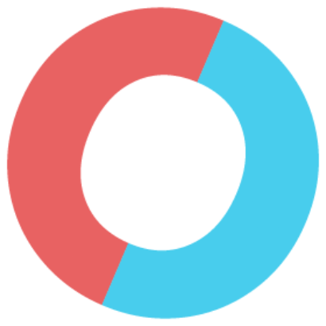
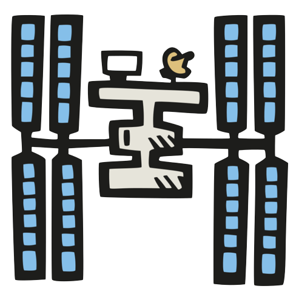
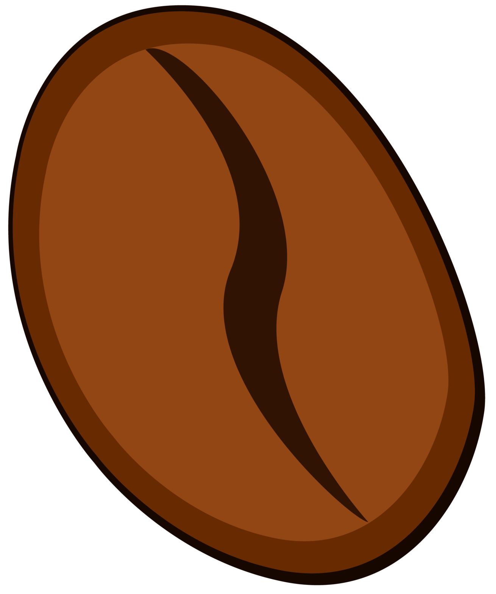
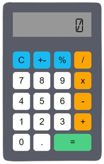
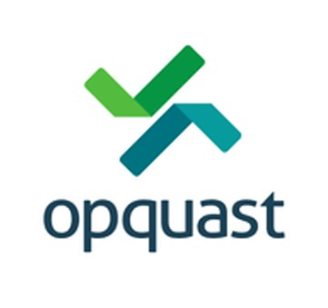

# 📫 Me contacter :

 

 
      

 
 
# Mes réalisations

 

 

### [Worduel - Jeu de type Wordle en Solo ou en Duel](https://worduel.fr/)

### [Seagale - Application utilisée en boutique](https://github.com/LaurentArcos/Cigale-POS-App)

### [assurancedespros.fr - Agence Allianz](https://www.assurancedespros.fr/)

### [TrackerApp de la Station Spatiale Internationale](https://laurentarcosisstracker.surge.sh/)

### [Site vitrine Coffee Shop](https://lacoffeedential.surge.sh/)

### [Weather App](http://laurentarcosweatherapp.surge.sh/) 

### [Trivia Quizz](https://laurentarcostriviaquizz.surge.sh/) 

### [TRIBU](https://tribu.surge.sh/) - provisoirement hors ligne 
##### En attendant consultez le [repository du Frontend](https://github.com/LaurentArcos/Tribu-Front) et ma [Présentation sur YouTube](https://youtu.be/Q3WiRGLeXSQ?t=426) 

### [Calculatrice](https://laurentarcoscalculatrice.surge.sh/)

### [Flags of the World](https://laurentarcosflagsoftheworld.surge.sh/)

 

Voir tous mes repositories : 

 

# 🛠 Compétences

 
 
## Certification [Opquast](https://www.opquast.com/)

855 pts obtenus

Maîtrise avancée de la qualité en projet web
[Voir le certificat](https://directory.opquast.com/fr/certificat/SMY4W8/)

 
 
## Les langages et technos

 

## Mes outils

 

## Côté design

 

# 👩‍💻 Quelques stats

<!---->

 

